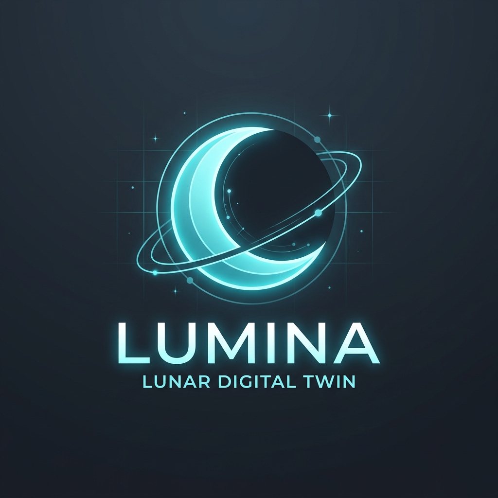
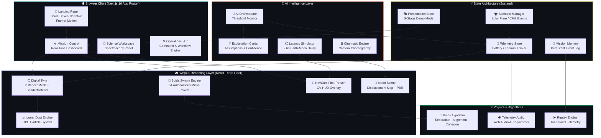
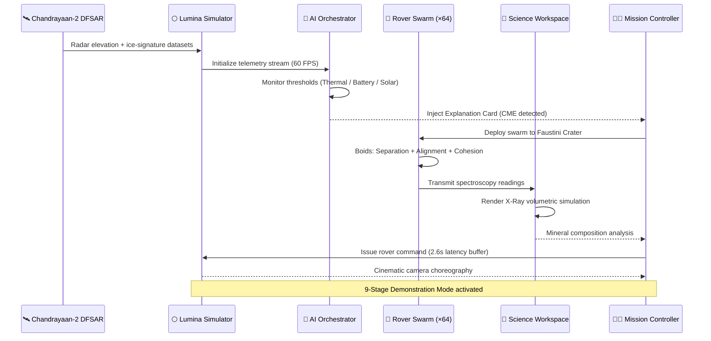

<div align="center">



<br/>

```
██╗     ██╗   ██╗███╗   ███╗██╗███╗   ██╗ █████╗
██║     ██║   ██║████╗ ████║██║████╗  ██║██╔══██╗
██║     ██║   ██║██╔████╔██║██║██╔██╗ ██║███████║
██║     ██║   ██║██║╚██╔╝██║██║██║╚██╗██║██╔══██║
███████╗╚██████╔╝██║ ╚═╝ ██║██║██║ ╚████║██║  ██║
╚══════╝ ╚═════╝ ╚═╝     ╚═╝╚═╝╚═╝  ╚═══╝╚═╝  ╚═╝
```

### **LUNAR DIGITAL TWIN · ISRO · MISSION INTELLIGENCE PLATFORM**

*Next-generation autonomous swarm navigation, explainable AI reasoning, and real-time spectroscopy — designed for the Moon.*

<br/>

[](https://antigravity-faxkdjo57-sai-chintamanis-projects.vercel.app/)
[](https://antigravity-faxkdjo57-sai-chintamanis-projects.vercel.app/mission-control)
[](https://www.isro.gov.in/)

<br/>


</div>

---

## 🌌 What is Lumina?

> *"We don't just simulate the Moon. We think about it."*

**Lumina** is a browser-native, production-ready **Lunar Mission Digital Twin** — a real-time simulation platform that mirrors the exact conditions at **Faustini Crater**, Lunar South Pole. It combines autonomous multi-agent robotics, an explainable AI orchestrator, volumetric science instruments, and a cinematic narrative UX into a single, unified Mission Control environment.

Built on findings from **Chandrayaan-2's DFSAR radar** and informed by ISRO's South Polar exploration objectives, Lumina bridges the gap between raw planetary science and operational decision-making.

---

## 🚀 Tech Stack

<div align="center">

### Core Platform


### 3D & Visualization Engine


### AI / ML Intelligence Layer


### Geospatial & Mapping


### State & Audio


### Deployment


</div>

---

## 🏗️ System Architecture



---

## 🔬 Scientific Workflow



---

## ✨ What Makes Lumina Unique

<table>
<tr>
<td width="50%">

### 🤖 Autonomous Boids Swarm
64 micro-rovers running **Craig Reynolds' Boids Algorithm** in real-time inside the browser — separation, alignment, cohesion — all rendered as `InstancedMesh` at 60 FPS via WebGL. No server. No pre-computation.

</td>
<td width="50%">

### 🧠 Explainable AI Orchestrator
The AI doesn't just act — it **explains itself**. When a Coronal Mass Ejection spikes thermal readings, the platform generates a structured reasoning card with Assumptions, Evidence, and a Confidence Score in real time.

</td>
</tr>
<tr>
<td width="50%">

### ⏱️ Earth-Moon Latency Simulator
Physics-accurate **2.6-second round-trip delay** between Earth and the Moon. Commands are buffered in the HUD with visual uplink/downlink progress bars before the rover executes them on the 3D surface.

</td>
<td width="50%">

### 🔬 Volumetric Spectroscopy
The Science Workspace simulates an **X-Ray fluorescence spectrometer** — rendering sub-surface mineral composition data (Mg, Fe, Ca, Al) from Chandrayaan-2 observations in real time.

</td>
</tr>
<tr>
<td width="50%">

### 🎬 Cinematic Engine
A fully scripted **camera choreography system** — the platform can transition from orbital overview to crater surface to rover first-person with smooth, cinematic keyframe interpolation.

</td>
<td width="50%">

### 🎭 9-Stage Demo Mode
Built-in **Presentation Mode** that guides audiences through the full mission — from Mission Introduction to AI Reasoning to Scenario Comparison — controllable with Prev/Next/Skip.

</td>
</tr>
<tr>
<td width="50%">

### 📸 NavCam ML Computer Vision HUD
Drop into the rover's first-person camera. Simulated **ML bounding boxes** scan the terrain, detecting slope hazards (>15°) and thermal anomalies with live confidence percentages.

</td>
<td width="50%">

### ♟️ Mission Memory & Time-Travel
Every telemetry event is logged to the **Mission Memory store**. The Replay Engine lets you scrub back through the mission history to any point in time, re-experiencing the simulation.

</td>
</tr>
</table>

---

## 🗂️ Project Structure

```
lumina/
├── src/
│   ├── app/
│   │   ├── page.tsx                    # 🚀 Scroll-driven landing page
│   │   ├── mission-control/page.tsx    # 🛸 Main dashboard
│   │   ├── science/page.tsx            # 🔬 Science workspace
│   │   └── operations/page.tsx         # ⚙️ Operations hub
│   ├── components/
│   │   ├── visualization/
│   │   │   ├── DigitalTwin.tsx         # 🌕 Core 3D WebGL scene
│   │   │   ├── RoverSwarm.tsx          # 🤖 Boids swarm (64 agents)
│   │   │   ├── MoonScene.tsx           # 🌌 Scroll-linked lunar globe
│   │   │   ├── LunarDustEngine.tsx     # 🌫️ GPU particle system
│   │   │   └── ScientificDigitalTwin.tsx # 🔬 Science 3D view
│   │   ├── intelligence/
│   │   │   ├── AIOrchestrator.tsx      # 🧠 Threshold AI monitor
│   │   │   └── ExplanationCard.tsx     # 💡 XAI reasoning UI
│   │   ├── effects/
│   │   │   ├── ComputerVisionHUD.tsx   # 📸 NavCam ML overlay
│   │   │   ├── LatencyHUD.tsx          # ⏱️ Earth-Moon delay HUD
│   │   │   └── GlitchOverlay.tsx       # ⚡ Solar flare visual FX
│   │   ├── mission-control/
│   │   │   ├── SubsystemHUD.tsx        # 📊 Battery/Thermal/Solar panels
│   │   │   ├── MiniMapHUD.tsx          # 🗺️ Crater mini-map
│   │   │   └── ReplayControls.tsx      # ▶️ Time-travel scrubber
│   │   ├── presentation/
│   │   │   └── DemonstrationMode.tsx   # 🎭 9-stage presenter UI
│   │   └── operations/
│   │       ├── CommandPalette.tsx      # ⌨️ Ctrl+K command terminal
│   │       ├── WorkflowEngine.tsx      # 🔄 Mission workflow builder
│   │       └── DataIngestion.tsx       # 📡 Data ingestion pipeline
│   └── lib/
│       ├── physics/boidsEngine.ts      # ⚛️ Reynolds Boids algorithm
│       ├── memory/
│       │   ├── useTelemetryStore.ts    # 📡 Zustand telemetry stream
│       │   ├── missionMemory.ts        # 🧩 Event log persistence
│       │   ├── cinematicEngine.ts      # 🎬 Camera choreography
│       │   └── scenarioManager.ts      # 🌪️ CME/Flare scenario control
│       ├── audio/
│       │   ├── useTelemetryAudio.ts    # 🔊 Web Audio API synthesis
│       │   └── useVoiceSynthesis.ts    # 🗣️ Mission voice announcements
│       └── presentation/
│           └── usePresentationStore.ts # 🎭 Demo mode state
├── public/
│   ├── lumina_logo.png                 # ✨ Gemini-generated logo
│   └── moon_color.jpg                  # 🌕 Lunar surface texture
├── vercel.json                         # 🚀 Production deployment config
└── README.md                           # 📖 This file
```

---

## ⚡ Quickstart

```bash
# 1. Clone the repository
git clone https://github.com/saichintamani/Lumina-.git
cd Lumina-

# 2. Install dependencies
npm install

# 3. Launch Mission Control
npm run dev

# 4. Open the platform
#    Landing page:    http://localhost:3000
#    Mission Control: http://localhost:3000/mission-control
#    Science Lab:     http://localhost:3000/science
```

> 💡 **Pro Tip**: Once inside Mission Control, press `Ctrl+K` to open the **Command Palette** — your terminal for triggering Solar Flares, deploying the Rover Swarm, toggling the NavCam, or activating Demonstration Mode.

---

## 🎮 Key Controls

| Action | Shortcut |
|--------|----------|
| Open Command Palette | `Ctrl+K` |
| Deploy Rover Swarm | Command Palette → *Deploy Swarm* |
| NavCam First-Person | Command Palette → *Toggle NavCam* |
| Trigger Solar Flare | Command Palette → *Trigger Solar Flare* |
| Earth-Moon Latency | Command Palette → *Enable Latency Sim* |
| Demonstration Mode | Command Palette → *Start Presentation* |
| Orbital Camera | Drag / Scroll on the 3D viewport |

---

## 🌍 Scientific Foundation

| Data Source | Instrument | Parameter |
|-------------|-----------|-----------|
| Chandrayaan-2 | DFSAR (Dual-frequency SAR) | Sub-surface ice detection |
| Chandrayaan-2 | CLASS (X-ray spectrometer) | Elemental composition |
| LOLA / LRO | Laser Altimeter | Crater elevation model |
| ISRO PRADAN | Polar Region Analysis | Thermal excursion mapping |
| Faustini Crater | -85.46°S, 30.12°E | Primary mission target |

---

## 🏆 Recognition

> Built as part of the **ISRO Space Application Research Program** — focusing on autonomous lunar exploration at the South Polar Region, inspired by findings from Chandrayaan-2 and the scientific groundwork laid for future crewed Moon missions.

---

<div align="center">

### Built with ❤️ for the Moon

**[🌐 Live Platform](https://antigravity-faxkdjo57-sai-chintamanis-projects.vercel.app/) · [🛸 Mission Control](https://antigravity-faxkdjo57-sai-chintamanis-projects.vercel.app/mission-control) · [🐙 GitHub](https://github.com/saichintamani/Lumina-)**

<br/>

*"Ad astra per aspera — through hardships to the stars."*


</div>
