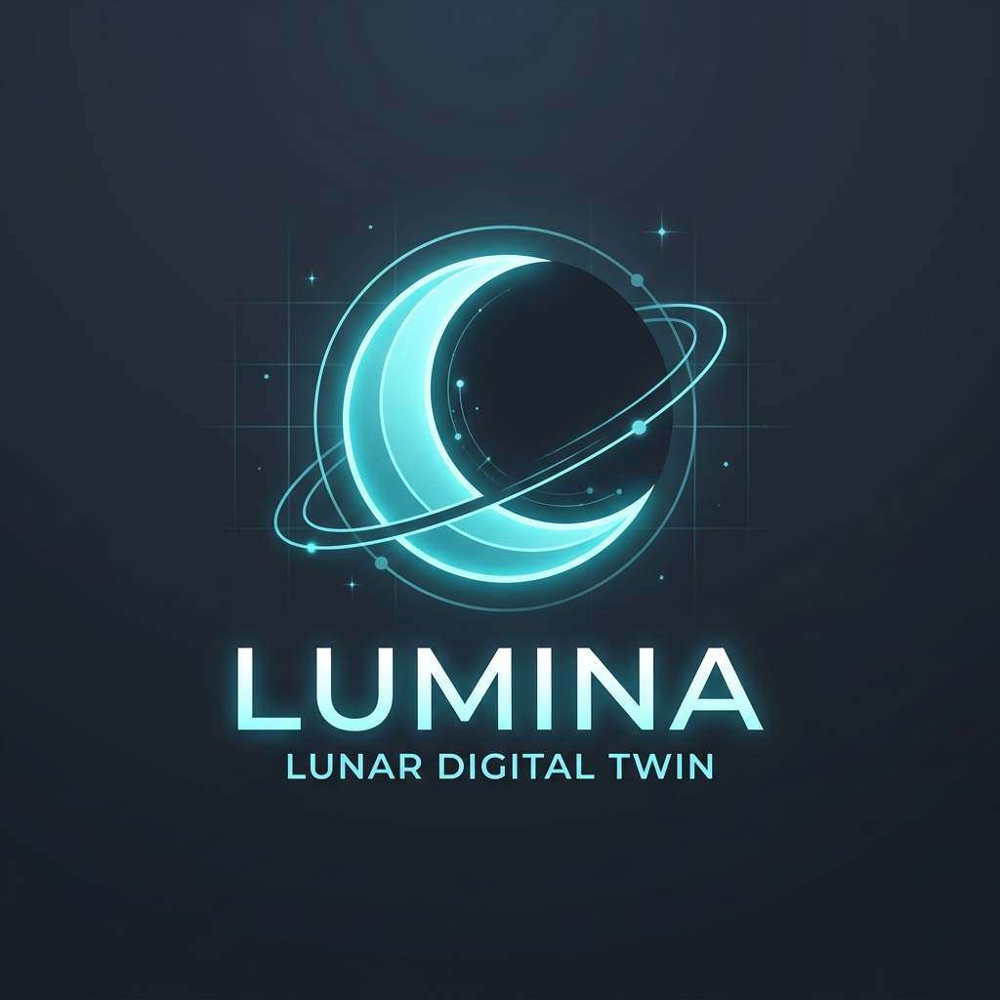
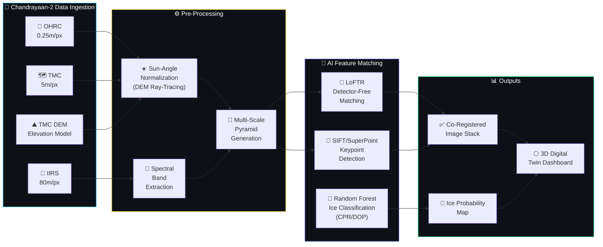
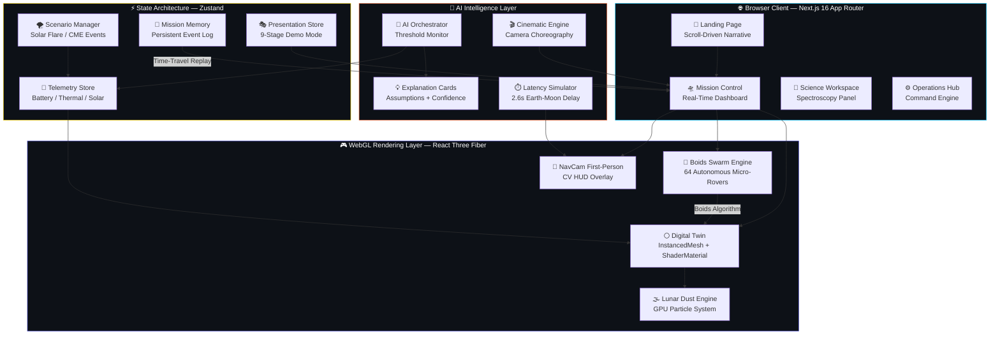

<div align="center">



<br/>

<pre>
██╗     ██╗   ██╗███╗   ███╗██╗███╗   ██╗ █████╗
██║     ██║   ██║████╗ ████║██║████╗  ██║██╔══██╗
██║     ██║   ██║██╔████╔██║██║██╔██╗ ██║███████║
██║     ██║   ██║██║╚██╔╝██║██║██║╚██╗██║██╔══██║
███████╗╚██████╔╝██║ ╚═╝ ██║██║██║ ╚████║██║  ██║
╚══════╝ ╚═════╝ ╚═╝     ╚═╝╚═╝╚═╝  ╚═══╝╚═╝  ╚═╝
</pre>

<a href="https://git.io/typing-svg"></a>

<br/>

### **LUMINA — Lunar Digital Twin · Mission Intelligence Platform**

*Next-generation multi-modal image correspondence, autonomous swarm navigation, explainable AI reasoning, and real-time spectroscopy — designed for the Moon.*

<br/>

[](https://www.sih.gov.in/)
[]()
[](https://hack2skill.com/)

<br/>

[](https://lumina-zeta-sand.vercel.app)
[](https://lumina-zeta-sand.vercel.app/mission-control)
[](https://www.isro.gov.in/)

<br/>


</div>


## 🏆 SIH Achievement — Bharatiya Antariksh Hackathon 2026

<div align="center">

<table>
<tr>
<td align="center" width="25%">

### 🎯 Problem Statement
**SIH26166**
<br/>
Multi-modal, Sun angle & scale invariant image correspondence

</td>
<td align="center" width="25%">

### 🏅 Status
**QUALIFIED**
<br/>
Smart India Hackathon — Intern Hackathon Round

</td>
<td align="center" width="25%">

### 🥉 Ranking
**3rd Place**
<br/>
Across all participating teams in the college

</td>
<td align="center" width="25%">

### 👥 Team
**LumaInit**
<br/>
Powered by ISRO & Hack2skill

</td>
</tr>
</table>

</div>

> **📋 Official Problem Statement:** *"Multi-modal, Sun angle and scale invariant image correspondence using Chandrayaan-2 optical images (OHRC, TMC and IIRS)."*
>
> Our solution **Lumina** addresses this challenge by building a complete end-to-end pipeline — from deep-learned feature matching (LoFTR) and DEM-based sun-angle normalization, to a production-grade **3D Lunar Mission Digital Twin** that visualizes co-registered multi-modal imagery in real-time.


## 🌌 The Challenge

Chandrayaan-2 carries three optical instruments that image the lunar surface at **vastly different scales, spectral bands, and lighting conditions**:

<div align="center">

| Instrument | Resolution | Spectral Range | Challenge |
|:---:|:---:|:---:|:---:|
| **OHRC** (Orbiter High Resolution Camera) | **0.25 m/pixel** | Panchromatic | Ultra-high detail, narrow swath |
| **TMC** (Terrain Mapping Camera) | **5 m/pixel** | Panchromatic (stereo) | 20× scale gap from OHRC |
| **IIRS** (Imaging IR Spectrometer) | **80 m/pixel** | 0.8–5.0 μm (256 bands) | 320× scale gap, hyperspectral |

</div>

**The core problem:** How do you find corresponding points across a **320× scale difference**, across **different spectral bands** (panchromatic vs. hyperspectral), and across **different Sun illumination angles** that cast entirely different shadow patterns on the lunar surface?


## 🧠 Our Solution — The Lumina Pipeline


```mermaid
flowchart LR
    subgraph INPUT["📡 Chandrayaan-2 Data Ingestion"]
        OHRC["🔬 OHRC\n0.25m/px"]
        TMC["🗺️ TMC\n5m/px"]
        IIRS["🌈 IIRS\n80m/px"]
        DEM["⛰️ TMC DEM\nElevation Model"]
    end

    subgraph PREPROCESS["⚙️ Pre-Processing"]
        NORM["☀️ Sun-Angle\nNormalization\n(DEM Ray-Tracing)"]
        SCALE["📐 Multi-Scale\nPyramid\nGeneration"]
        SPEC["🌈 Spectral\nBand\nExtraction"]
    end

    subgraph AI["🧠 AI Feature Matching"]
        LOFTR["🔗 LoFTR\nDetector-Free\nMatching"]
        SIFT["🔑 SIFT/SuperPoint\nKeypoint\nDetection"]
        RF["🌲 Random Forest\nIce Classification\n(CPR/DOP)"]
    end

    subgraph OUTPUT["📊 Outputs"]
        REG["✅ Co-Registered\nImage Stack"]
        TWIN["🌕 3D Digital\nTwin Dashboard"]
        ICE["🧊 Ice Probability\nMap"]
    end

    OHRC --> NORM
    TMC --> NORM
    IIRS --> SPEC
    DEM --> NORM
    NORM --> SCALE
    SPEC --> SCALE
    SCALE --> LOFTR
    SCALE --> SIFT
    LOFTR --> REG
    SIFT --> REG
    REG --> TWIN
    RF --> ICE
    ICE --> TWIN

    style INPUT fill:#0d1117,stroke:#00C7FF,color:#fff
    style PREPROCESS fill:#0d1117,stroke:#FFD700,color:#fff
    style AI fill:#0d1117,stroke:#6366F1,color:#fff
    style OUTPUT fill:#0d1117,stroke:#00FF88,color:#fff
```

### Key Technical Approaches

<table>
<tr>
<td width="50%">

#### 🔗 Scale-Invariant Feature Matching
We employ **LoFTR** (Local Feature Matching with Transformers) — a detector-free deep learning approach that uses self- and cross-attention to produce dense correspondences that survive the **20×–320× scale differences** between OHRC, TMC, and IIRS images.

</td>
<td width="50%">

#### ☀️ Sun-Angle Normalization via DEM
Lunar shadows shift drastically with the Sun angle. We use the **TMC Digital Elevation Model** to perform physics-based ray-tracing, simulating and normalizing illumination conditions *before* feature extraction — making the pipeline **Sun-angle invariant**.

</td>
</tr>
<tr>
<td width="50%">

#### 🧊 AI-Powered Ice Classification
Integrates synthetic **DFSAR polarimetry** (Circular Polarization Ratio & Degree of Polarization) with thermal constraints via **Random Forest** to predict sub-surface water-ice probability at permanently shadowed regions.

</td>
<td width="50%">

#### 🌕 3D Digital Twin Dashboard
A browser-native **WebGL Mission Control** built with Three.js + React Three Fiber — draping co-registered multi-modal data over a 3D DEM mesh, with real-time sun/shadow physics, autonomous rover swarms, and AI-powered telemetry.

</td>
</tr>
</table>


## 🚀 Tech Stack

<div align="center">

### Core Platform


### 3D & Visualization


### AI / ML Pipeline


### Deployment & Data


</div>


## ✨ Platform Highlights

<table>
<tr>
<td width="50%">

### 🤖 Autonomous Boids Swarm
64 micro-rovers running **Craig Reynolds' Boids Algorithm** in real-time inside the browser — separation, alignment, cohesion — all rendered as `InstancedMesh` at 60 FPS via WebGL.

</td>
<td width="50%">

### 🧠 Explainable AI Orchestrator
The AI doesn't just act — it **explains itself**. When a Coronal Mass Ejection spikes thermal readings, the platform generates a structured reasoning card with Assumptions, Evidence, and Confidence Scores.

</td>
</tr>
<tr>
<td width="50%">

### ⏱️ Earth-Moon Latency Simulator
Physics-accurate **2.6-second round-trip delay** between Earth and the Moon. Commands are buffered with visual uplink/downlink progress bars before the rover executes them on the 3D surface.

</td>
<td width="50%">

### 🔬 Volumetric Spectroscopy
Simulated **X-Ray fluorescence spectrometer** — rendering sub-surface mineral composition (Mg, Fe, Ca, Al) from Chandrayaan-2 observations in real time.

</td>
</tr>
<tr>
<td width="50%">

### 🎬 Cinematic Engine
Fully scripted **camera choreography system** — transitions from orbital overview to crater surface to rover first-person with smooth, cinematic keyframe interpolation.

</td>
<td width="50%">

### 🎭 9-Stage Demo Mode
Built-in **Presentation Mode** guiding audiences through the full mission — from Introduction to AI Reasoning to Scenario Comparison — controllable with Prev/Next/Skip.

</td>
</tr>
</table>


## 📊 AI Pipeline & Datasets

The deep learning pipeline for scale-invariant multi-modal alignment is hosted entirely on **Kaggle** with GPU acceleration:

<div align="center">

[](https://www.kaggle.com/code/saichintamaniai/isro-lunar-surface-loftr-feature-matching)

[](https://www.kaggle.com/datasets/saichintamaniai/isro-lunar-surface-matching)

</div>

| Resource | Description | Link |
|:---|:---|:---:|
| 📓 **AI Pipeline Notebook** | PyTorch-based LoFTR for detector-free scale-invariant matching + RF Ice Classification | [Open on Kaggle →](https://www.kaggle.com/code/saichintamaniai/isro-lunar-surface-loftr-feature-matching) |
| 📦 **Lunar Dataset** | Multi-modal Chandrayaan-2 imagery (OHRC, TMC, IIRS) for training and evaluation | [Open on Kaggle →](https://www.kaggle.com/datasets/saichintamaniai/isro-lunar-surface-matching) |
| 🌐 **Live Platform** | Production deployment of the 3D Digital Twin Mission Control | [Open on Vercel →](https://lumina-zeta-sand.vercel.app) |
| 🐙 **Source Code** | Full repository with pipeline code, dashboard, and research documentation | [Open on GitHub →](https://github.com/saichintamani/Lumina-) |


## 🌐 Live Deployment

<div align="center">

### 🌟 Experience the Lumina Digital Twin Live

| Page | URL | Description |
|:---:|:---:|:---|
| 🚀 **Landing** | [lumina-zeta-sand.vercel.app](https://lumina-zeta-sand.vercel.app) | Scroll-driven narrative introduction |
| 🛸 **Mission Control** | [/mission-control](https://lumina-zeta-sand.vercel.app/mission-control) | Real-time 3D dashboard with rover swarms |
| 🔬 **Science Lab** | [/science](https://lumina-zeta-sand.vercel.app/science) | Spectroscopy & mineral analysis workspace |
| ⚙️ **Operations** | [/operations](https://lumina-zeta-sand.vercel.app/operations) | Command palette & workflow engine |

</div>


## 🏗️ System Architecture


```mermaid
graph TB
    subgraph CLIENT["🌐 Browser Client — Next.js 16 App Router"]
        LP["🚀 Landing Page<br/>Scroll-Driven Narrative"]
        MC["🛸 Mission Control<br/>Real-Time Dashboard"]
        SCI["🔬 Science Workspace<br/>Spectroscopy Panel"]
        OPS["⚙️ Operations Hub<br/>Command Engine"]
    end

    subgraph RENDER["🎮 WebGL Rendering Layer — React Three Fiber"]
        DT["🌕 Digital Twin<br/>InstancedMesh + ShaderMaterial"]
        SWARM["🤖 Boids Swarm Engine<br/>64 Autonomous Micro-Rovers"]
        DUST["🌫️ Lunar Dust Engine<br/>GPU Particle System"]
        NAVCAM["📸 NavCam First-Person<br/>CV HUD Overlay"]
    end

    subgraph AI["🧠 AI Intelligence Layer"]
        ORCH["🎯 AI Orchestrator<br/>Threshold Monitor"]
        EXPL["💡 Explanation Cards<br/>Assumptions + Confidence"]
        LATENCY["⏱️ Latency Simulator<br/>2.6s Earth-Moon Delay"]
        CINE["🎬 Cinematic Engine<br/>Camera Choreography"]
    end

    subgraph STATE["⚡ State Architecture — Zustand"]
        TELEM["📡 Telemetry Store<br/>Battery / Thermal / Solar"]
        MEM["🧩 Mission Memory<br/>Persistent Event Log"]
        PRES["🎭 Presentation Store<br/>9-Stage Demo Mode"]
        SCENARIO["🌪️ Scenario Manager<br/>Solar Flare / CME Events"]
    end

    LP --> MC
    MC --> DT
    MC --> SWARM
    MC --> NAVCAM
    DT --> DUST
    SWARM --> |Boids Algorithm| DT
    ORCH --> EXPL
    ORCH --> TELEM
    TELEM --> DT
    CINE --> MC
    PRES --> MC
    SCENARIO --> TELEM
    LATENCY --> NAVCAM
    MEM --> |Time-Travel Replay| MC

    style CLIENT fill:#0d1117,stroke:#00C7FF,color:#fff
    style RENDER fill:#0d1117,stroke:#6366F1,color:#fff
    style AI fill:#0d1117,stroke:#FF6B35,color:#fff
    style STATE fill:#0d1117,stroke:#FFD700,color:#fff
```


## 🗂️ Repository Structure

```
Lumina-/
├── 📁 antigravity/                    # 🌕 Next.js 16 Dashboard (Production)
│   ├── src/
│   │   ├── app/                       # App Router pages
│   │   │   ├── page.tsx               # 🚀 Scroll-driven landing
│   │   │   ├── mission-control/       # 🛸 3D Mission Control
│   │   │   ├── science/               # 🔬 Spectroscopy workspace
│   │   │   └── operations/            # ⚙️ Operations hub
│   │   ├── components/
│   │   │   ├── visualization/         # 🌕 DigitalTwin, RoverSwarm, MoonScene
│   │   │   ├── intelligence/          # 🧠 AIOrchestrator, ExplanationCard
│   │   │   ├── effects/               # 📸 NavCam HUD, Latency, Glitch FX
│   │   │   └── presentation/          # 🎭 DemonstrationMode
│   │   └── lib/
│   │       ├── physics/               # ⚛️ Boids algorithm engine
│   │       ├── memory/                # 🧩 Telemetry, Mission Memory, Scenarios
│   │       └── audio/                 # 🔊 Web Audio synthesis
│   └── public/                        # Static assets (textures, logo)
│
├── 📁 src/                            # 🐍 Python CV Pipeline
│   ├── image_registration.py          # SIFT/LoFTR feature extraction
│   ├── ml_ice_classification.py       # Random Forest ice classifier
│   ├── data_pipeline.py               # Data ingestion & preprocessing
│   └── make_figures.py                # Generate analysis figures
│
├── 📁 kaggle_notebook/                # 📓 Kaggle AI Notebook
│   └── isro-lunar-loftr-matching.ipynb
│
├── 📁 kaggle_dataset/                 # 📦 Kaggle Dataset Config
│   ├── dataset-metadata.json
│   └── processed/                     # Processed imagery
│
├── 📁 figures/                        # 📊 Generated Analysis Figures
│   ├── fig01_sun_angle_normalization.png
│   ├── fig02_scale_invariant_matching.png
│   ├── fig09_architecture.png
│   └── ... (10 scientific figures)
│
├── 📁 docs/                           # 📄 Strategy & Submission Decks
│   ├── BAH2026_Strategy_Guide.pdf
│   └── BAH2026_Submission_Deck.pptx
│
├── 📁 MoonRef/                        # 🌕 3D Moon Visualizer (Three.js)
│   └── index.html                     # Standalone lunar globe
│
└── README.md                          # 📖 This file
```


## ⚡ Quickstart

```bash
# 1. Clone the repository
git clone https://github.com/saichintamani/Lumina-.git
cd Lumina-

# 2. Launch the 3D Dashboard
cd antigravity
npm install
npm run dev
# → Open http://localhost:3000

# 3. Run the Python CV Pipeline (optional)
pip install numpy scipy matplotlib rasterio
cd src
python make_figures.py
python make_architecture_diagram.py
```

> 💡 **Pro Tip**: Press `Ctrl+K` inside Mission Control to open the **Command Palette** — trigger Solar Flares, deploy the Rover Swarm, toggle NavCam, or activate Demo Mode.


## 🌍 Scientific Foundation

| Data Source | Instrument | Parameter | Usage |
|:---|:---|:---|:---|
| Chandrayaan-2 | DFSAR (Dual-frequency SAR) | Sub-surface ice detection | Ice probability mapping |
| Chandrayaan-2 | OHRC (0.25m/px) | High-res panchromatic | Feature matching anchor |
| Chandrayaan-2 | TMC (5m/px, stereo) | DEM + surface mapping | Sun-angle normalization |
| Chandrayaan-2 | IIRS (80m/px, 256 bands) | Hyperspectral imaging | Mineral spectroscopy |
| Chandrayaan-2 | CLASS (X-ray spectrometer) | Elemental composition | Terrain classification |
| LRO | LOLA (Laser Altimeter) | Crater elevation model | 3D mesh generation |
| ISRO PRADAN | Polar Region Analysis | Thermal excursion data | PSR identification |

**Primary Mission Target:** Faustini Crater (−85.46°S, 30.12°E) — Lunar South Pole


## 📚 References & Resources

<div align="center">

| Resource | Type | Link |
|:---|:---:|:---:|
| 🏆 Smart India Hackathon | Competition | [sih.gov.in](https://www.sih.gov.in/) |
| 🚀 ISRO Official | Organization | [isro.gov.in](https://www.isro.gov.in/) |
| 🤝 Hack2skill | Platform | [hack2skill.com](https://hack2skill.com/) |
| 📓 Kaggle AI Notebook | Notebook | [Lunar LoFTR Matching](https://www.kaggle.com/code/saichintamaniai/isro-lunar-surface-loftr-feature-matching) |
| 📦 Kaggle Dataset | Dataset | [Lunar Surface Matching](https://www.kaggle.com/datasets/saichintamaniai/isro-lunar-surface-matching) |
| 🌐 Live Platform | Deployment | [lumina-zeta-sand.vercel.app](https://lumina-zeta-sand.vercel.app) |
| 🐙 Source Code | Repository | [saichintamani/Lumina-](https://github.com/saichintamani/Lumina-) |

</div>


## 🏆 Recognition

<div align="center">

```
╔══════════════════════════════════════════════════════════════╗
║                                                              ║
║   🏆  SMART INDIA HACKATHON (BAH 2026)  —  QUALIFIED        ║
║   🥉  SECURED 3RD RANK ACROSS THE COLLEGE                   ║
║                                                              ║
║   Problem Statement : SIH26166                               ║
║   Organization      : ISRO × Hack2skill                     ║
║   Team              : LumaInit                               ║
║   Challenge         : Multi-Modal Lunar Image                ║
║                       Correspondence                         ║
║                                                              ║
╚══════════════════════════════════════════════════════════════╝
```

Built for the **Bharatiya Antariksh Hackathon 2026** — advancing autonomous lunar exploration at the South Polar Region, inspired by **Chandrayaan-2** and the scientific groundwork laid for future crewed Moon missions.

</div>


<div align="center">

### Built with ❤️ for the Moon

**[🌐 Live Platform](https://lumina-zeta-sand.vercel.app) · [🛸 Mission Control](https://lumina-zeta-sand.vercel.app/mission-control) · [📓 Kaggle Notebook](https://www.kaggle.com/code/saichintamaniai/isro-lunar-surface-loftr-feature-matching) · [🐙 GitHub](https://github.com/saichintamani/Lumina-)**

<br/>

*"Ad astra per aspera — through hardships to the stars."*

<br/>


*Developed for the Smart India Hackathon 2026, powered by ISRO & Hack2skill. Represented by Team LumaInit.*

</div>
